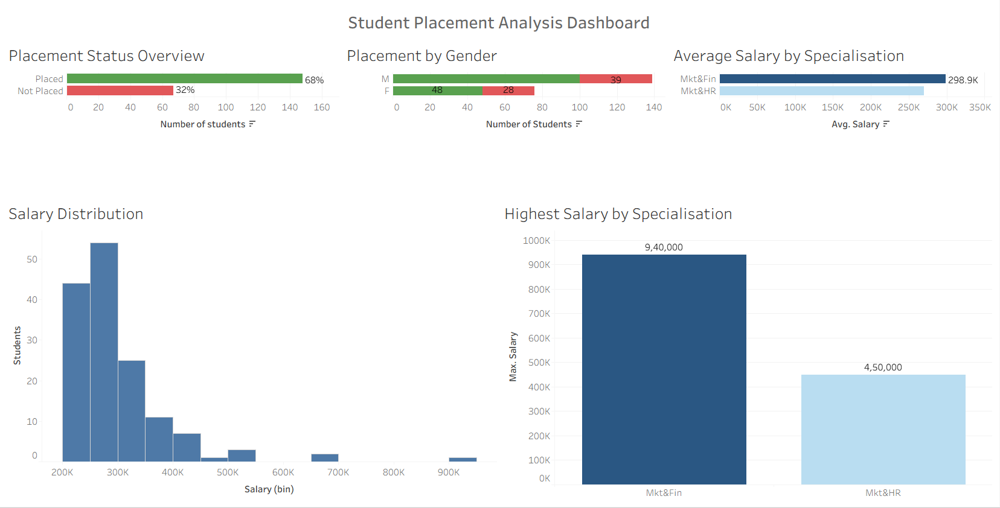

# Student Placement Analysis Dashboard

## Project Overview

This project analyzes student placement data using Tableau. The dashboard provides insights into placement status, salary distribution, gender-wise placements, and specialization-wise salary performance.

## Tools Used

- Tableau Public
- CSV Dataset
- GitHub

## Dashboard Visualizations

1. Placement Status Overview
2. Placement by Gender
3. Average Salary by Specialisation
4. Salary Distribution
5. Highest Salary by Specialisation

## Key Insights

- 68% of students were successfully placed.
- Marketing & Finance students received higher average salaries.
- Highest package offered was ₹9.4 LPA.
- Most salaries were concentrated between ₹2L and ₹3.5L.
- Placement opportunities were distributed across both genders.

## Dashboard Screenshot

## Dataset

Student placement dataset containing academic scores, specialization, gender, salary, and placement status.

## Author

Bhaskar Nakka
